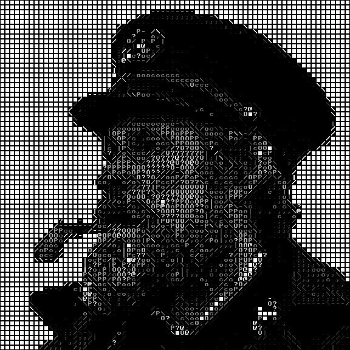

# Image to ASCII image (WIP)

## About
This program can convert a regular image into an image made with ASCII characters.
The main difference between my and most other projects is that it can detect edges. Hence, the objects
will be much more defined using edge characters.

## Example
|           Original           |              ASCII              |
|:----------------------------:|:-------------------------------:|
|  |  |

## Gui

## TODO
- [x] Basic functionality
- [x] Edge detection
- [x] Add GUI
- [ ] Add more options to GUI
    - [x] Image Upscaling
    - [ ] Change font
    - [ ] Different charset
- [ ] Create Web App

Inspired by Acerola
